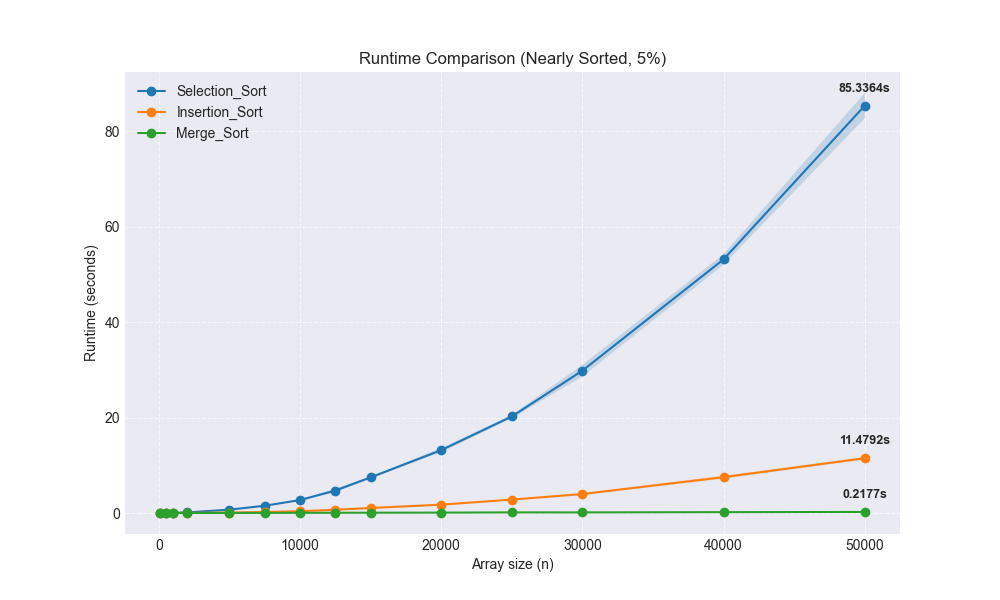
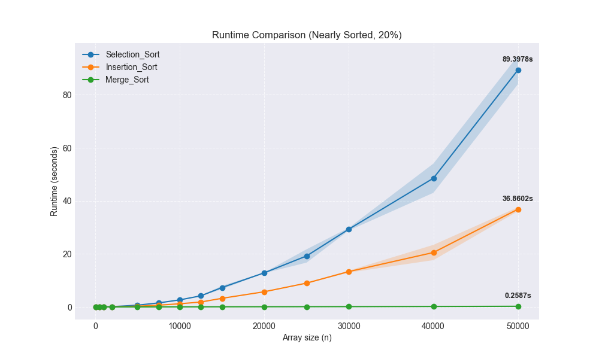

# Sorting_Assignment
Data Structures Course - Python_HW_1

**Students:**
* Name: רועי אוסובסקי
* Name: איתמר גרשון

**Course:** Data Structures (Spring 2026)

**"AI Transparency" Clause:**
While we understand the theoretical mechanics and Big-O complexities of the chosen
algorithms, to optimize our workflow we utilized an AI assistant (+ The Internet) to help bridge our
knowledge gap regarding Python-specific syntax, the argparse CLI setup, and
matplotlib generation. The experimental design and analysis of the algorithmic
behavior are our own.

## Our Choice of Algorithms:
For this assignment, the following three sorting algorithms were implemented and analyzed:
1. **Selection Sort** (`O(n^2)`)
2. **Insertion Sort** (`O(n^2)`)
3. **Merge Sort** (`O(n log n)`)

---

## Experiments with Random Arrays:

### Analysis of The Results (Random Arrays):
The above figure illustrates the experimental running times of the three algorithms on arrays filled with completely random integers (fully unsorted arrays). 

* **Selection Sort & Insertion Sort:** As Expected, both algorithms exhibit a clear quadratic growth rate $O(n^2)$.
*  As the array size $n$ increases, the time taken to sort it grows exponentially, as visually represented by the steep quadratic parabolic upward curves. In a purely random scenario, Insertion Sort performs very similarly to Selection Sort because it frequently has to shift elements across the array.
  
* **Merge Sort:** The green line demonstrates the efficiency of the Divide-and-Conquer approach. It maintains a highly efficient $O(n \log n)$ growth rate, staying almost flat at the bottom of the graph compared to the quadratic algorithms. 

---

## Experiments with Partial Order (5% Noise - Nearly Sorted Arrays):

### Analysis of The Results (Sorted Array with 5% Noise):
This experiment tests the algorithms on an array that is mostly sorted but contains 5% random noise (swaps). 

The running times changed drastically depending on the algorithm's adaptability to pre-existing order:
* **Insertion Sort :** The running time plummeted, operating in near-linear $O(n)$ time which is the biggest change that we got. Since 95% of the array is already sorted, the inner `while` loop of the algorithm rarely executes. It simply skips elements that are already in the correct position, making it incredibly fast for this specific dataset.
  
* **Selection Sort (No Change):** The runtime remained strictly $O(n^2)$ , therefore we can clearly see that the Selection Sort Algorithm is not an adaptive algorithm; it blindly scans the entire remaining unsorted section to find the minimum element every single time, regardless of whether the array is already sorted.
  
* **Merge Sort (No Change):** The runtime remained stable at $O(n \log n)$. Merge Sort consistently divides the array in half and merges it, performing the exact same amount of structural work regardless of the initial order of the elements.

---

## Additional Analysis for fun: (20% Noise Level):

### Analysis of The Results (20% Noise):
When we increased the noise level to 20%, we can clearly observe the limitations of Insertion Sort's adaptability.

While Merge Sort and Selection Sort remain completely unfazed (performing identical operations to purely random arrays / with 5% noise), Insertion Sort begins to struggle. Because there are significantly more elements out of place, Insertion Sort is forced to execute its inner loop more frequently, shifting many more elements to the right. As a result, its plot line begins to curve upward, abandoning its linear shape and reverting back toward its theoretical $O(n^2)$ worst-case boundary.
